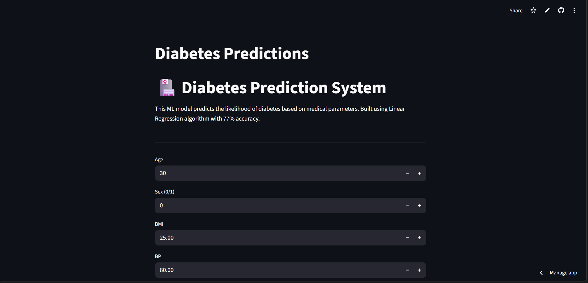

# DiabetesPredictions

# Software And Tools Requirements

1.[Github Account](https://github.com)

2.[VSCodeIDE](https://code.visualstudio.com/)

3.[HerokuAccount](https://heroku.com)

4.[GitCLI](https://git-scm.com/book/en/v2/Getting-Started-The-Command-Line)

Create a new Environment

```
conda create -p venv python==3.7 -y
```

# 🏥 Diabetes Prediction System

A machine learning web application that predicts diabetes risk based on medical parameters.

## 🚀 Live Demo
**[Try it here!](https://diabetespredictions-ngyczqg6pwzjbjnxwpepub.streamlit.app/)**

## 📊 About
This project uses a Linear Regression model trained on the  Indians Diabetes Database to predict the likelihood of diabetes based on 8 medical parameters.

## 🎯 Features
- Real-time predictions
- User-friendly interface
- Deployed on Streamlit Cloud

## 🛠️ Tech Stack
- Python
- Scikit-learn
- Streamlit
- Pandas, NumPy

## 📈 Model Performance
- Algorithm: Linear Regression
- Accuracy: ~77%
- Dataset: 442 rows, 10 columns

## 🏃‍♂️ Run Locally
```bash
git clone [https://github.com/vamsi-krishna108/DiabetesPredictions.git]
cd [DiabetesPredictions]
pip install -r requirements.txt
streamlit run app.py
```

## 📸 Screenshots


## 👨‍💻 Author
[Jonnagiri Vamsi Krishna] - [LinkedIn : https://www.linkedin.com/in/vamsi-krishna-4210a1325/] - [Email : vamshikrishna4444j@gmail.com]


```

🔗 Live Demo: https://diabetespredictions-ngyczqg6pwzjbjnxwpepub.streamlit.app/

#MachineLearning #DataScience #Python #AI #100DaysOfCode #BTech
